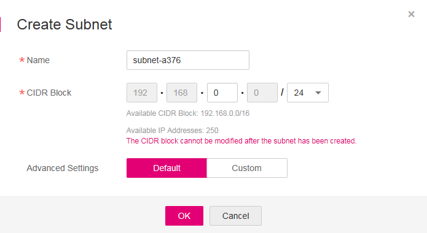

# Step 2: Create a Subnet for the VPC

## Scenarios

A VPC comes with a default subnet. If the default subnet cannot meet your requirements, you can create one.

The subnet is configured with DHCP by default. When an ECS using this VPC starts, the ECS automatically uses DHCP to obtain an IP address.

## Procedure

1.  Log in to the management console.
2.  Click    in the upper left corner and select the desired region and project.
3.  On the console homepage, under  **Network**, click  **Virtual Private Cloud**.
4.  In the navigation pane on the left, click  **Virtual Private Cloud**.
5.  On the  **Virtual Private Cloud**  page, locate the VPC for which a subnet is to be created and click the VPC name.
6.  On the displayed  **Subnets**  tab, click  **Create Subnet**. 
7.  Set the parameters as prompted.

    **Figure  1**  Create Subnet  
    

    **Table  1**  Parameter description

    
    <table><thead align="left"><tr id="en-us_topic_0013748726_row152091427193914"><th class="cellrowborder" valign="top" width="19.24%" id="mcps1.2.4.1.1">
Parameter

    </th>
    <th class="cellrowborder" valign="top" width="55.7%" id="mcps1.2.4.1.2">
Description

    </th>
    <th class="cellrowborder" valign="top" width="25.06%" id="mcps1.2.4.1.3">
Example Value

    </th>
    </tr>
    </thead>
    <tbody><tr id="en-us_topic_0013748726_row1420922733913"><td class="cellrowborder" valign="top" width="19.24%" headers="mcps1.2.4.1.1 ">
Name

    </td>
    <td class="cellrowborder" valign="top" width="55.7%" headers="mcps1.2.4.1.2 ">
Specifies the subnet name.

    
The VPC flow log name can contain a maximum of 64 characters, which may consist of letters, digits, underscores (_), hyphens (-), and periods (.). The name cannot contain spaces.

    </td>
    <td class="cellrowborder" valign="top" width="25.06%" headers="mcps1.2.4.1.3 ">
Subnet

    </td>
    </tr>
    <tr id="en-us_topic_0013748726_row820919275399"><td class="cellrowborder" valign="top" width="19.24%" headers="mcps1.2.4.1.1 ">
CIDR Block

    </td>
    <td class="cellrowborder" valign="top" width="55.7%" headers="mcps1.2.4.1.2 ">
Specifies the CIDR block for the subnet. This value must be within the VPC CIDR block.

    </td>
    <td class="cellrowborder" valign="top" width="25.06%" headers="mcps1.2.4.1.3 ">
192.168.0.0/24

    </td>
    </tr>
    <tr id="en-us_topic_0013748726_row1968522515187"><td class="cellrowborder" valign="top" width="19.24%" headers="mcps1.2.4.1.1 ">
Advanced Settings

    </td>
    <td class="cellrowborder" valign="top" width="55.7%" headers="mcps1.2.4.1.2 ">
Two options are available, <strong id="en-us_topic_0013748726_b448422410434">Default</strong> and <strong id="en-us_topic_0013748726_b64851124104317">Custom</strong>. You can set <strong id="en-us_topic_0013748726_b5682154017593">Advanced Settings</strong> to <strong id="en-us_topic_0013748726_b19682740115913">Custom</strong> to configure advanced subnet parameters.

    </td>
    <td class="cellrowborder" valign="top" width="25.06%" headers="mcps1.2.4.1.3 ">
Default

    </td>
    </tr>
    <tr id="en-us_topic_0013748726_row1221062712396"><td class="cellrowborder" valign="top" width="19.24%" headers="mcps1.2.4.1.1 ">
Gateway

    </td>
    <td class="cellrowborder" valign="top" width="55.7%" headers="mcps1.2.4.1.2 ">
Specifies the gateway address of the subnet.

    </td>
    <td class="cellrowborder" valign="top" width="25.06%" headers="mcps1.2.4.1.3 ">
192.168.0.1

    </td>
    </tr>
    <tr id="en-us_topic_0013748726_row814813278462"><td class="cellrowborder" valign="top" width="19.24%" headers="mcps1.2.4.1.1 ">
DNS Server Address

    </td>
    <td class="cellrowborder" valign="top" width="55.7%" headers="mcps1.2.4.1.2 ">
By default, two DNS server addresses are configured. You can change them if necessary. A maximum of five DNS server addresses can be configured. Multiple IP addresses must be separated using commas (,).

    </td>
    <td class="cellrowborder" valign="top" width="25.06%" headers="mcps1.2.4.1.3 ">
100.125.x.x

    </td>
    </tr>
    <tr id="en-us_topic_0013748726_row19210152793912"><td class="cellrowborder" valign="top" width="19.24%" headers="mcps1.2.4.1.1 ">
NTP Server Address

    </td>
    <td class="cellrowborder" valign="top" width="55.7%" headers="mcps1.2.4.1.2 ">
Specifies the IP address of the NTP server. This parameter is optional.

    
You can configure the NTP server IP addresses to be added to the subnet as required. The IP addresses are added in addition to the default NTP server addresses. If this parameter is left empty, no IP address of the NTP server is added.

    
A maximum of four IP addresses can be configured. Multiple IP addresses must be separated using commas (,).

    </td>
    <td class="cellrowborder" valign="top" width="25.06%" headers="mcps1.2.4.1.3 ">
192.168.2.1

    </td>
    </tr>
    <tr id="en-us_topic_0013748726_row18210162714395"><td class="cellrowborder" valign="top" width="19.24%" headers="mcps1.2.4.1.1 ">
Tag

    </td>
    <td class="cellrowborder" valign="top" width="55.7%" headers="mcps1.2.4.1.2 ">
Specifies the subnet tag, which consists of a key and value pair. You can add a maximum of ten tags to each subnet.

    
The tag key and value must meet the requirements listed in <a href="#en-us_topic_0013748726_table42131827173915">Table 2</a>.

    </td>
    <td class="cellrowborder" valign="top" width="25.06%" headers="mcps1.2.4.1.3 "><ul id="en-us_topic_0013748726_ul13210152793913"><li>Key: subnet_key1</li><li>Value: subnet-01</li></ul>
    </td>
    </tr>
    </tbody>
    </table>

    **Table  2**  Subnet tag key and value requirements

    
    <table><thead align="left"><tr id="en-us_topic_0013748726_vpc_vpc_0005_rd57708e01e6443a9805ca72f554fae7f"><th class="cellrowborder" valign="top" width="18.54%" id="mcps1.2.4.1.1">
<strong id="en-us_topic_0013748726_vpc_vpc_0005_b842352706165123">Parameter</strong>

    </th>
    <th class="cellrowborder" valign="top" width="53.39%" id="mcps1.2.4.1.2">
<strong id="en-us_topic_0013748726_vpc_vpc_0005_b842352706174218">Requirements</strong>

    </th>
    <th class="cellrowborder" valign="top" width="28.07%" id="mcps1.2.4.1.3">
<strong id="en-us_topic_0013748726_vpc_vpc_0005_b842352706174227">Example Value</strong>

    </th>
    </tr>
    </thead>
    <tbody><tr id="en-us_topic_0013748726_vpc_vpc_0005_r95612b479088487b99e620f90b71f798"><td class="cellrowborder" valign="top" width="18.54%" headers="mcps1.2.4.1.1 ">
Key

    </td>
    <td class="cellrowborder" valign="top" width="53.39%" headers="mcps1.2.4.1.2 "><ul id="en-us_topic_0013748726_vpc_vpc_0005_uac40e19ce4ac49d0913d48b334564c45"><li>Cannot be left blank.</li><li>Must be unique for each subnet.</li><li>Can contain a maximum of 36 characters.</li><li>Can contain only the following character types:<ul id="en-us_topic_0013748726_vpc_vpc_0005_uccb317c6616b4445aa84b125e5aa017f"><li>Uppercase letters</li><li>Lowercase letters</li><li>Digits</li><li>Special characters, including hyphens (-) and underscores (_)</li></ul>
    </li></ul>
    </td>
    <td class="cellrowborder" valign="top" width="28.07%" headers="mcps1.2.4.1.3 ">
subnet_key1

    </td>
    </tr>
    <tr id="en-us_topic_0013748726_vpc_vpc_0005_r32a79d8bde844fda8a6254383317e58f"><td class="cellrowborder" valign="top" width="18.54%" headers="mcps1.2.4.1.1 ">
Value

    </td>
    <td class="cellrowborder" valign="top" width="53.39%" headers="mcps1.2.4.1.2 "><ul id="en-us_topic_0013748726_vpc_vpc_0005_uaf17b1ea9b9a4e58b95cafefa2898283"><li>Can contain a maximum of 43 characters.</li><li>Can contain only the following character types:<ul id="en-us_topic_0013748726_vpc_vpc_0005_ub74c759faad544c3b4428accc9c42b80"><li>Uppercase letters</li><li>Lowercase letters</li><li>Digits</li><li>Special characters, including hyphens (-) and underscores (_)</li></ul>
    </li></ul>
    </td>
    <td class="cellrowborder" valign="top" width="28.07%" headers="mcps1.2.4.1.3 ">
subnet-01

    </td>
    </tr>
    </tbody>
    </table>

8.  Click  **OK**.

## Precautions

When a subnet is created, there are five reserved IP addresses, which cannot be used. For example, in a subnet with CIDR block 192.168.0.0/24, the following IP addresses are reserved:

-   192.168.0.0: Network ID. This address is the beginning of the private IP address range and will not be assigned to any instance.
-   192.168.0.1: Gateway address.
-   192.168.0.253: Reserved for the system interface. This IP address is used by the VPC for external communication.
-   192.168.0.254: DHCP service address.
-   192.168.0.255: Network broadcast address.

If you set  **Advanced Settings**  to  **Custom**  during subnet creation, the reserved IP addresses may be different from the default ones, but there will still be five of them. The specific addresses depend on your subnet settings.

