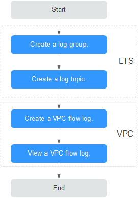

# VPC Flow Log Overview

A VPC flow log records information about the traffic going to and from a VPC. VPC flow logs help you monitor network traffic, analyze network attacks, and determine whether security group and firewall rules require modification.

VPC flow logs must be used together with the Log Tank Service \(LTS\). You need to create a log group and a log topic in LTS, and then create a VPC flow log.  [Figure 1](#fig1535115691415)  shows the procedure for configuring the VPC flow log function.

**Figure  1**  Procedure for configuring the VPC flow log function  

## Usage Restrictions

-   Currently, only C3, M3, and S2 ECSs support VPC flow logs.
-   By default, a user can create a maximum of 10 VPC flow logs.
-   By default, a maximum of 400,000 flow logs are supported.

