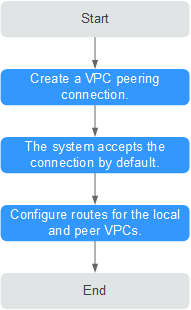
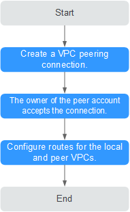

# VPC Peering Connection Creation Procedure

A VPC peering connection is a network connection between two VPCs that enables you to route traffic between them using private IP addresses. ECSs in either VPC can communicate with each other just as if they were in the same VPC. You can create a VPC peering connection between your own VPCs, or between your VPC and another account's VPC within the same region. A VPC peering connection between VPCs in different regions will not take effect.

-   Creating a VPC peering connection between VPCs in your account

    **Figure  1**  Creating a VPC peering connection between VPCs in your account  
    

    If you create a VPC peering connection between two VPCs in your account, the system automatically accepts the connection by default. You need to add routes for the local and peer VPCs to enable communication between the two VPCs.

-   Creating a VPC peering connection with a VPC in another account

    **Figure  2**  Creating a VPC peering connection with a VPC in another account  
    

    If you create a VPC peering connection between your VPC and a VPC that is in another account, the VPC peering connection will be in the  **Awaiting acceptance**  state. After the owner of the peer account accepts the connection, the connection status changes to  **Accepted**. The owners of the local and peer accounts must configure the routes required by the VPC peering connection to enable communication between the two VPCs.

    If the local and peer VPCs have overlapping CIDR blocks, the routes added for the VPC peering connection may be invalid. Before creating a VPC peering connection between two VPCs that have overlapping CIDR blocks, ensure that none of the subnets in the two VPCs overlap. In this case, the created VPC peering connection enables communication between two subnets in the two VPCs.

    You can run the  **ping**  command to check whether the two VPCs can communicate with each other.

