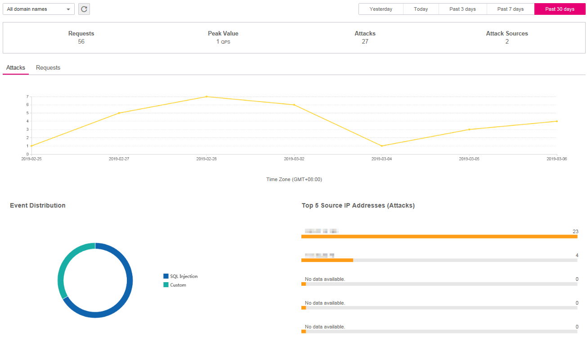

# Dashboard

This section describes how to  view event logs  in a specified time \(for example, today\), including attack and request statistics, the number of attacks from the top 5 source IP addresses, and event distribution.

## Prerequisites

Login credentials have been obtained.

## Procedure

1.  Log in to the management console.
2.  Click    in the upper left corner of the management console and select a region or project.
3.  Choose  **Security**  \>  **Web Application Firewall**. The  **Dashboard**  page is displayed.
4.  In the domain name drop-down list, select a domain name to view its event logs. The query time can be  **Yesterday**,  **Today**,  **Past 3 days**,  **Past 7 days**, and  **Past 30 days**  \(see  [Figure 1](#fig5451829111656)\).

    > **NOTE:**   
    >You can select  **All domain names**  or a specific domain name from the drop-down list.  

    **Figure  1**  Viewing event logs  
    

    **Table  1**  Parameter description of event logs

    
    <table><thead align="left"><tr id="row2386908311453"><th class="cellrowborder" valign="top" width="25.81258125812581%" id="mcps1.2.4.1.1">
Parameter

    </th>
    <th class="cellrowborder" valign="top" width="38.033803380338036%" id="mcps1.2.4.1.2">
Description

    </th>
    <th class="cellrowborder" valign="top" width="36.153615361536154%" id="mcps1.2.4.1.3">
Remarks

    </th>
    </tr>
    </thead>
    <tbody><tr id="row2572158511453"><td class="cellrowborder" valign="top" width="25.81258125812581%" headers="mcps1.2.4.1.1 ">
Requests

    </td>
    <td class="cellrowborder" valign="top" width="38.033803380338036%" headers="mcps1.2.4.1.2 ">
Total number of requests to the specified domain name

    
If <strong id="b1640172581218">All domain names</strong> is selected, the total number of requests to all domain names is displayed.

    </td>
    <td class="cellrowborder" valign="top" width="36.153615361536154%" headers="mcps1.2.4.1.3 ">
N/A

    </td>
    </tr>
    <tr id="row3264961511453"><td class="cellrowborder" valign="top" width="25.81258125812581%" headers="mcps1.2.4.1.1 ">
Peak Value

    </td>
    <td class="cellrowborder" valign="top" width="38.033803380338036%" headers="mcps1.2.4.1.2 ">
Maximum number of requests to the specified domain name per second

    </td>
    <td class="cellrowborder" valign="top" width="36.153615361536154%" headers="mcps1.2.4.1.3 ">
N/A

    </td>
    </tr>
    <tr id="row4258356411453"><td class="cellrowborder" valign="top" width="25.81258125812581%" headers="mcps1.2.4.1.1 ">
Attacks

    </td>
    <td class="cellrowborder" valign="top" width="38.033803380338036%" headers="mcps1.2.4.1.2 ">
Number of attacks on the specified domain name

    </td>
    <td class="cellrowborder" valign="top" width="36.153615361536154%" headers="mcps1.2.4.1.3 ">
N/A

    </td>
    </tr>
    <tr id="row6402915811453"><td class="cellrowborder" valign="top" width="25.81258125812581%" headers="mcps1.2.4.1.1 ">
Attack Sources

    </td>
    <td class="cellrowborder" valign="top" width="38.033803380338036%" headers="mcps1.2.4.1.2 ">
Number of sources that attack the specified domain name

    </td>
    <td class="cellrowborder" valign="top" width="36.153615361536154%" headers="mcps1.2.4.1.3 ">
N/A

    </td>
    </tr>
    <tr id="row5712464411453"><td class="cellrowborder" valign="top" width="25.81258125812581%" headers="mcps1.2.4.1.1 ">
Attacks

    </td>
    <td class="cellrowborder" valign="top" width="38.033803380338036%" headers="mcps1.2.4.1.2 ">
Trend of attacks

    </td>
    <td class="cellrowborder" valign="top" width="36.153615361536154%" headers="mcps1.2.4.1.3 ">
The trend of attacks is displayed by default.

    </td>
    </tr>
    <tr id="row5067778111453"><td class="cellrowborder" valign="top" width="25.81258125812581%" headers="mcps1.2.4.1.1 ">
Requests

    </td>
    <td class="cellrowborder" valign="top" width="38.033803380338036%" headers="mcps1.2.4.1.2 ">
Trend of requests

    </td>
    <td class="cellrowborder" valign="top" width="36.153615361536154%" headers="mcps1.2.4.1.3 ">
Click <strong id="b190251171112">Requests</strong> to view the trend of requests.

    </td>
    </tr>
    <tr id="row1844865611453"><td class="cellrowborder" valign="top" width="25.81258125812581%" headers="mcps1.2.4.1.1 ">
Event Distribution

    </td>
    <td class="cellrowborder" valign="top" width="38.033803380338036%" headers="mcps1.2.4.1.2 ">
Types of attack events

    </td>
    <td class="cellrowborder" valign="top" width="36.153615361536154%" headers="mcps1.2.4.1.3 "><ul id="ul5009385314278"><li>Click any colored area in the event distribution circle under <strong id="b842352706113520">Event Distribution</strong> to view the type, number, and proportion of an attack.</li><li>To stop displaying information about a specific type of event, click the corresponding legend with the same color to the right of the circle.</li></ul>
    </td>
    </tr>
    <tr id="row53276882114737"><td class="cellrowborder" valign="top" width="25.81258125812581%" headers="mcps1.2.4.1.1 ">
Top 5 Source IP Addresses (Attacks)

    </td>
    <td class="cellrowborder" valign="top" width="38.033803380338036%" headers="mcps1.2.4.1.2 ">
Top 5 attack source IP addresses and their cumulative number of attacks

    </td>
    <td class="cellrowborder" valign="top" width="36.153615361536154%" headers="mcps1.2.4.1.3 ">
N/A

    </td>
    </tr>
    </tbody>
    </table>

