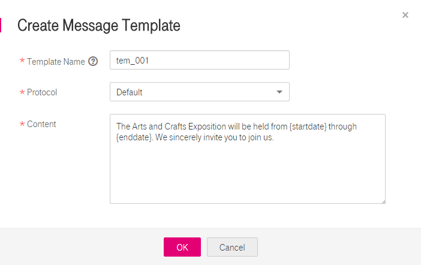
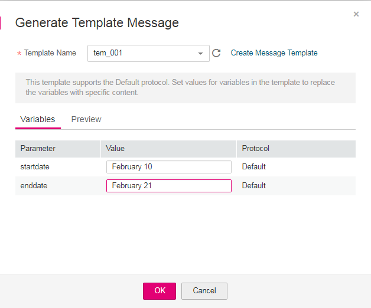
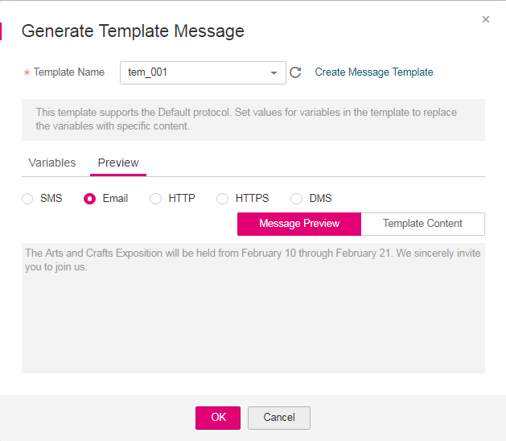
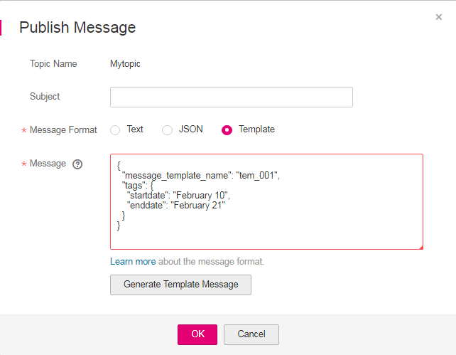

# Publishing a Template Message

## Scenario

Message templates contain fixed message content. If you need to send the same or similar messages multiple times, you can create a message template for quick message sending.

You can create different templates for different protocols using the same template name so that each type of subscribers can receive customized messages. Templates contain variables as the placeholders to represent changeable content that you can replace with your own message content. Note that you must create a template in the default protocol, or the system will not allow you to publish messages using this template name.

When creating messages using a template, you need to select a template name. The system will list all variables in the following protocol sequence: default, SMS, email, DMS, HTTP, and HTTPS. The same variables are listed only once even if they are used in multiple protocols, and the protocols they support are listed after each variable. You need to specify content for each variable in the message template, and SMN replaces them with the content you entered. If you do not enter any content for a variable, the system will treat it as empty when sending messages.

SMN tries to match different types of subscribers to the template protocols. If there is no template for a specified protocol, it will use the default template to send messages to subscribers of that protocol.

This section describes how to publish messages using a template. For more details about message templates, see  [Message Template Management](message-template-management.md).

## Prerequisites

Subscribers in the topic must have confirmed the subscription, or they will not be able to receive any messages.

## To Create a Message Template

1.  Log in to the management console.
2.  Click    on the upper left to select the desired region and project.
3.  In the  **Application**  category, click  **Simple Message Notification**.

    The SMN console is displayed.

4.  In the navigation pane, choose  **Message Templates**.

5.  Create a message template. For details, see  [To Create a Message Template](message-template-management.md#section66624127194914)  in  [Message Template Management](message-template-management.md).

    For example, the template information is as follows:

    -   **Template Name**:  **tem\_001**
    -   **Protocol**:  **Default**
    -   **Content**:  **The Arts and Crafts Exposition will be held from \{startdate\} through \{enddate\}. We sincerely invite you to join us.** 

        **Figure  1**  Create Message Template  
        

## To Publish a Template Message

1.  Log in to the management console.
2.  Click    on the upper left to select the desired region and project.
3.  In the  **Application**  category, click  **Simple Message Notification**.

    The SMN console is displayed.

4.  In the navigation pane, choose  **Topics**.

    The  **Topics**  page is displayed.

5.  In the topic list, locate the topic to which you need to publish a message and click  **Publish Message**  under  **Operation**.
6.  Configure the required parameters. The topic name is provided by default and cannot be changed.

    Select  **Template**  for  **Message Format**. Then, manually type the template content in the  **Message**  box or click  **Generate Template Message**  to generate it automatically. The template message content cannot exceed 256 KB.

    -   If you choose to manually type the template message, see  [Template Message Format](template-message-format.md)  for detailed requirements.
    -   If you choose to automatically generate the template message, proceed with steps  [7](#li37303092212221)  through  [10](#li3929025721230).

7.  Click  **Generate Template Message**.
8.  Select a template name, for example,  **tem\_001**, and enter values for the variables.

    The system replaces the variables with the message content you specified. The protocols configured in the template are displayed after each variable. In the example shown in the following figure, only the default protocol is specified in  **tem\_001**. Therefore, all confirmed subscribers in the topic will receive the message content in the default template. 

    **Figure  2**  Generate Template Message  
    

9.  Click the  **Preview**  tab to preview the message.

    In this example, the message generated is "The Arts and Crafts Exposition will be held from February 10 through February 21. We sincerely invite you to join us." 

    **Figure  3**  Previewing the template message  
    

10. Click  **OK**.

    The message that is generated contains the template name and variables.

    **Figure  4**  Template message example  
    

11. Click  **OK**.

    SMN delivers your message to all subscription endpoints. For details about messages for different protocols, see  [Messages of Different Protocols](messages-of-different-protocols.md).

