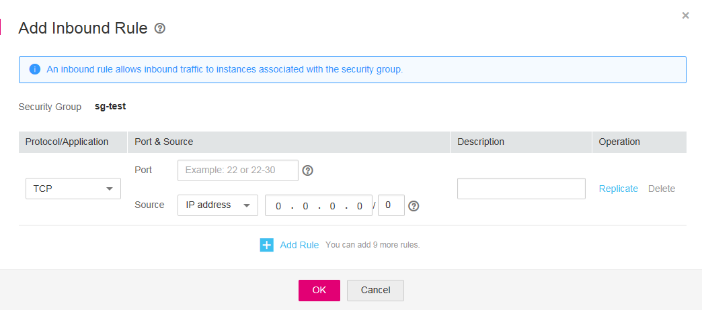

# Adding a Security Group Rule

## Scenarios

After a security group is created, you can add rules to the security group. A rule applies either to inbound traffic \(ingress\) or outbound traffic \(egress\). After ECSs are added to the security group, they are protected by the rules of that group.

-   Inbound rules control incoming traffic to ECSs associated with the security group.
-   Outbound rules control outgoing traffic from ECSs associated with the security group.

## Procedure

1.  Log in to the management console.
2.  Click    in the upper left corner and select the desired region and project.
3.  On the console homepage, under  **Network**, click  **Virtual Private Cloud**.
4.  In the navigation pane on the left, choose  **Access Control**  \>  **Security Groups**.
5.  On the  **Security Groups**  page, locate the target security group and click  **Manage Rule**  in the  **Operation**  column to switch to the page for managing inbound and outbound rules.
6.  On the inbound rule tab, click  **Add Rule**. In the displayed dialog box, set required parameters to add an inbound rule.

    You can click  **+**  to add more inbound rules.

    **Figure  1**  Add Inbound Rule  
    

    **Table  1**  Inbound rule parameter description

    
    <table><thead align="left"><tr id="en-us_topic_0118534005_row731911191722"><th class="cellrowborder" valign="top" width="28.299999999999997%" id="mcps1.2.4.1.1">
<strong id="en-us_topic_0118534005_b842352706114331">Parameter</strong>

    </th>
    <th class="cellrowborder" valign="top" width="53.7%" id="mcps1.2.4.1.2">
<strong id="en-us_topic_0118534005_b84235270694155">Description</strong>

    </th>
    <th class="cellrowborder" valign="top" width="18%" id="mcps1.2.4.1.3">
<strong id="en-us_topic_0118534005_b8423527069420">Example Value</strong>

    </th>
    </tr>
    </thead>
    <tbody><tr id="en-us_topic_0118534005_row8320419723"><td class="cellrowborder" valign="top" width="28.299999999999997%" headers="mcps1.2.4.1.1 ">
Protocol/Application

    </td>
    <td class="cellrowborder" valign="top" width="53.7%" headers="mcps1.2.4.1.2 ">
Specifies the network protocol. Currently, the value can be <strong id="en-us_topic_0118534005_b1166424112017">All</strong>, <strong id="en-us_topic_0118534005_b116533732012">TCP</strong>, <strong id="en-us_topic_0118534005_b9510134513200">UDP</strong>, <strong id="en-us_topic_0118534005_b10916155713209">ICMP</strong>, <strong id="en-us_topic_0118534005_b175264618215">GRE</strong>, or others.

    </td>
    <td class="cellrowborder" valign="top" width="18%" headers="mcps1.2.4.1.3 ">
TCP

    </td>
    </tr>
    <tr id="en-us_topic_0118534005_row1732101910217"><td class="cellrowborder" rowspan="2" valign="top" width="28.299999999999997%" headers="mcps1.2.4.1.1 ">
Port &amp; Source

    

    </td>
    <td class="cellrowborder" valign="top" width="53.7%" headers="mcps1.2.4.1.2 ">
<strong id="en-us_topic_0118534005_b6994125616147">Port</strong>: specifies the port or port range over which the traffic can reach your ECS. The value ranges from 1 to 65535. 

    </td>
    <td class="cellrowborder" valign="top" width="18%" headers="mcps1.2.4.1.3 ">
22 or 22-30

    </td>
    </tr>
    <tr id="en-us_topic_0118534005_row2032111191124"><td class="cellrowborder" valign="top" headers="mcps1.2.4.1.1 ">
<strong id="b83102261419">Source</strong>: specifies the source of the security group rule. The value can be another security group, a CIDR block, or a single IP address. For example:

    <ul id="en-us_topic_0118534005_ul474117187016"><li>xxx.xxx.xxx.xxx/32 (IPv4 address)</li><li>xxx.xxx.xxx.0/24 (subnet CIDR block)</li><li>0.0.0.0/0 (any IP address)</li></ul>
    </td>
    <td class="cellrowborder" valign="top" headers="mcps1.2.4.1.2 ">
0.0.0.0/0

    
default

    </td>
    </tr>
    <tr id="en-us_topic_0118534005_row1844612518515"><td class="cellrowborder" valign="top" width="28.299999999999997%" headers="mcps1.2.4.1.1 ">
Description

    </td>
    <td class="cellrowborder" valign="top" width="53.7%" headers="mcps1.2.4.1.2 ">
Provides supplementary information about the security group rule. This parameter is optional.

    
The security group rule description can contain a maximum of 255 characters and cannot contain angle brackets (&lt; or &gt;).

    </td>
    <td class="cellrowborder" valign="top" width="18%" headers="mcps1.2.4.1.3 ">
N/A

    </td>
    </tr>
    </tbody>
    </table>

7.  On the outbound rule tab, click  **Add Rule**. In the displayed dialog box, set required parameters to add an outbound rule.

    You can click  **+**  to add more outbound rules.

    **Figure  2**  Add Outbound Rule  
    

    **Table  2**  Outbound rule parameter description

    
    <table><thead align="left"><tr id="en-us_topic_0118534005_row1689515114136"><th class="cellrowborder" valign="top" width="28.299999999999997%" id="mcps1.2.4.1.1">
<strong id="b749943084">Parameter</strong>

    </th>
    <th class="cellrowborder" valign="top" width="53.7%" id="mcps1.2.4.1.2">
<strong id="b872681780">Description</strong>

    </th>
    <th class="cellrowborder" valign="top" width="18%" id="mcps1.2.4.1.3">
<strong id="b1515984461">Example Value</strong>

    </th>
    </tr>
    </thead>
    <tbody><tr id="en-us_topic_0118534005_row139013518139"><td class="cellrowborder" valign="top" width="28.299999999999997%" headers="mcps1.2.4.1.1 ">
Protocol/Application

    </td>
    <td class="cellrowborder" valign="top" width="53.7%" headers="mcps1.2.4.1.2 ">
Specifies the network protocol. Currently, the value can be <strong id="en-us_topic_0118534005_b757165142411">All</strong>, <strong id="en-us_topic_0118534005_b185711451112416">TCP</strong>, <strong id="en-us_topic_0118534005_b857235122419">UDP</strong>, <strong id="en-us_topic_0118534005_b14572185102415">ICMP</strong>, <strong id="en-us_topic_0118534005_b1257315110245">GRE</strong>, or others.

    </td>
    <td class="cellrowborder" valign="top" width="18%" headers="mcps1.2.4.1.3 ">
TCP

    </td>
    </tr>
    <tr id="en-us_topic_0118534005_row159061451141316"><td class="cellrowborder" rowspan="2" valign="top" width="28.299999999999997%" headers="mcps1.2.4.1.1 ">
Port &amp; Destination

    </td>
    <td class="cellrowborder" valign="top" width="53.7%" headers="mcps1.2.4.1.2 ">
<strong id="en-us_topic_0118534005_b670323214221">Port</strong>: specifies the port or port range over which the traffic can leave your ECS. The value ranges from 1 to 65535. 

    </td>
    <td class="cellrowborder" valign="top" width="18%" headers="mcps1.2.4.1.3 ">
22 or 22-30

    </td>
    </tr>
    <tr id="en-us_topic_0118534005_row1491445114138"><td class="cellrowborder" valign="top" headers="mcps1.2.4.1.1 ">
<strong id="b16986174181619">Destination</strong>: specifies the destination of the security group rule. The value can be another security group, a CIDR block, or a single IP address. For example:

    <ul id="en-us_topic_0118534005_ul1971712284017"><li>xxx.xxx.xxx.xxx/32 (IPv4 address)</li><li>xxx.xxx.xxx.0/24 (subnet CIDR block)</li><li>0.0.0.0/0 (any IP address)</li></ul>
    </td>
    <td class="cellrowborder" valign="top" headers="mcps1.2.4.1.2 ">
0.0.0.0/0

    
default

    </td>
    </tr>
    <tr id="en-us_topic_0118534005_row139271451151311"><td class="cellrowborder" valign="top" width="28.299999999999997%" headers="mcps1.2.4.1.1 ">
Description

    </td>
    <td class="cellrowborder" valign="top" width="53.7%" headers="mcps1.2.4.1.2 ">
Provides supplementary information about the security group rule. This parameter is optional.

    
The security group rule description can contain a maximum of 255 characters and cannot contain angle brackets (&lt; or &gt;).

    </td>
    <td class="cellrowborder" valign="top" width="18%" headers="mcps1.2.4.1.3 ">
N/A

    </td>
    </tr>
    </tbody>
    </table>

8.  Click  **OK**.

