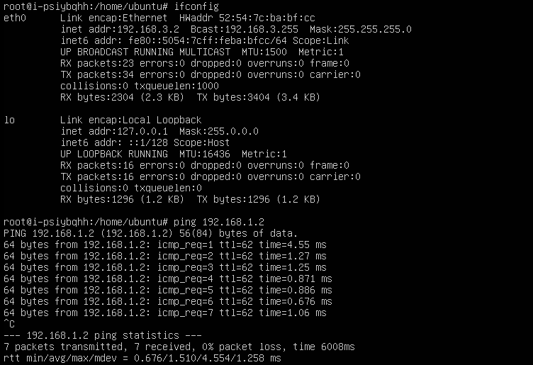

# How Do I Configure a Remote Device for a VPN?<a name="vpn_07_0010"></a>

Due to the symmetry of the tunnel, the VPN parameters configured on the cloud must be the same as those configured in your own data center. If they are different, a VPN cannot be established.

To set up a VPN, you also need to configure the IPsec VPN on the router or firewall in your own data center. The configuration method may vary depending on your network device in use. For details, see the configuration guide of your network device.

This section describes how to configure the IPsec VPN on a Huawei USG6600 series V100R001C30SPC300 firewall for your reference.

For example, the subnets of the data center are 192.168.3.0/24 and 192.168.4.0/24, the subnets of the VPC are 192.168.1.0/24 and 192.168.2.0/24, and the public IP address of the IPsec tunnel egress in the VPC is  _XXX.XXX.XX.XX_, which can be obtained from the local gateway parameters of the IPsec VPN in the VPC.

## **Procedure**<a name="en-us_topic_0026963459_section56339147163111"></a>

1.  Log in to the CLI of the firewall.
2.  Check firewall version information.

    ```
    display version 
    17:20:502017/03/09
    Huawei Versatile Security Platform Software
    Software Version: USG6600 V100R001C30SPC300 (VRP (R) Software, Version 5.30)
    ```

3.  Create an access control list \(ACL\) and bind it to the target VPN instance.

    ```
    acl number 3065 vpn-instance vpn64
    rule 1 permit ip source 192.168.3.0 0.0.0.255 destination 192.168.1.0 0.0.0.255
    rule 2 permit ip source 192.168.3.0 0.0.0.255 destination 192.168.2.0 0.0.0.255
    rule 3 permit ip source 192.168.4.0 0.0.0.255 destination 192.168.1.0 0.0.0.255
    rule 4 permit ip source 192.168.4.0 0.0.0.255 destination 192.168.2.0 0.0.0.255
    q 
    ```

4.  Create an IKE proposal.

    ```
    ike proposal 64 
    dh group5 
    authentication-algorithm sha1 
    integrity-algorithm hmac-sha2-256 
    sa duration 3600 
    q
    ```

5.  Create an IKE peer and reference the created IKE proposal. The peer IP address is 93.188.242.110.

    ```
    ike peer vpnikepeer_64
    pre-shared-key ******** (******** specifies the pre-shared key.)
    ike-proposal 64
    undo version 2
    remote-address vpn-instance vpn64 93.188.242.110
    sa binding vpn-instance vpn64
    q
    ```

6.  Create an IPsec protocol.

    ```
    ipsec proposal ipsecpro64
    encapsulation-mode tunnel
    esp authentication-algorithm sha1
    q
    ```

7.  Create an IPsec policy and reference the IKE policy and IPsec proposal.

    ```
    ipsec policy vpnipsec64 1 isakmp
    security acl 3065
    pfs dh-group5
    ike-peer vpnikepeer_64
    proposal ipsecpro64
    local-address xx.xx.xx.xx
    q
    ```

8.  Apply the IPsec policy to the subinterface.

    ```
    interface GigabitEthernet0/0/2.64
    ipsec policy vpnipsec64
    q
    ```

9.  Test the connectivity.

    After you perform the preceding operations, you can test the connectivity between your ECSs in the cloud and the hosts in your data center. For details, see the following figure.

    


